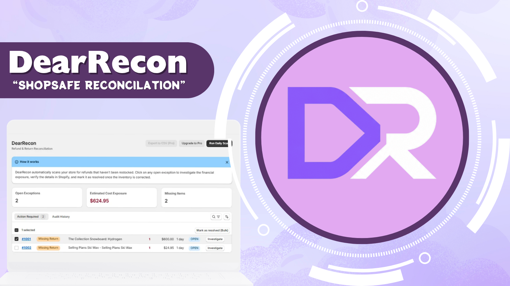
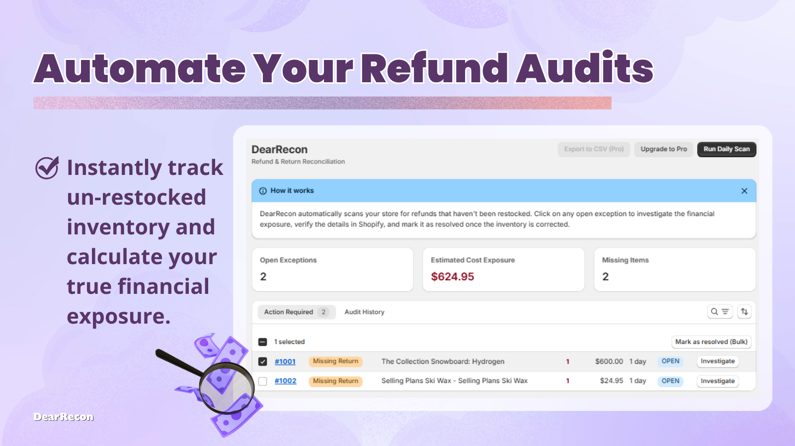

  

<table border="0" width="100%" style="border-collapse: collapse; margin-top: 20px;">
  <tr>
    <td width="20%" align="center" valign="middle">
      
    </td>
    <td width="80%" valign="middle" style="padding-left: 20px;">
      
      

        <strong>IT graduate interested in hands-on, practical technology work</strong>—especially troubleshooting, systems support, networking, and infrastructure. I enjoy solving technical problems, working with both hardware and software, and continuously learning how systems work together. Currently looking to grow through a full-time IT role where I can contribute, gain real-world experience, and build toward a career in IT infrastructure and networking. ᕙ(`▿´)ᕗ
      

      

        
        
        
      

    </td>
  </tr>
</table>

<h3>Languages & Tools (⌐■_■)</h3>

  
    
  

<h2>Project Showcase ⊂(≽^•⩊•^≼)つ</h2>

<h3>Modern Full-Stack Web Applications ✧*｡٩(ˊᗜˋ*)و✧*｡</h3>
<table border="0" width="100%">
  <tr>
    <td width="60%" valign="top">
      <strong>Allen Icee Portfolio</strong> 
      <em>React.js, Vite, Tailwind CSS, Framer Motion, Firebase, Three.js</em>  
      <ul>
        <li>A highly optimized, interactive developer portfolio and digital art gallery.</li>
        <li>Features interactive 3D elements and parallax animations using Framer Motion and Three.js.</li>
        <li>Dynamic project shelves and experience timelines powered by Firebase Firestore.</li>
      </ul>
      
      
    </td>
    <td width="40%" align="center" valign="middle">
        
      
    </td>
  </tr>
  <tr>
    <td width="60%" valign="top">
      <strong>dear-recon (Shopify App)</strong> 
      <em>Remix, React.js, Prisma, PostgreSQL, Shopify GraphQL</em>  
      <ul>
        <li>An inventory reconciliation Shopify app to track discrepancies between refunded and returned items.</li>
        <li>Automated exception detection through GraphQL scanning of store orders.</li>
        <li>Clean Polaris UI dashboard for merchants to manage inventory exceptions.</li>
      </ul>
      
      
    </td>
    <td width="40%" align="center" valign="middle">
        
      
    </td>
  </tr>
  <tr>
    <td width="60%" valign="top">
      <strong>Rental by Nicole</strong> 
      <em>React.js, Vite, Supabase, Tailwind CSS, TypeScript</em>  
      <ul>
        <li>A modern web application for a boutique fashion rental service.</li>
        <li>Interactive digital storefront with an availability calendar and sizing guides.</li>
        <li>Secure admin dashboard for inventory management with full CRUD capabilities.</li>
      </ul>
      
      
    </td>
    <td width="40%" align="center" valign="middle">
        
      
    </td>
  </tr>
  <tr>
    <td width="60%" valign="top">
      <strong>Dearest Journal</strong> 
      <em>React.js, Vite, TypeScript, IndexedDB, Base64</em>  
      <ul>
        <li>A local-first, privacy-focused digital journal replicating a physical notebook.</li>
        <li>Zero backend with complete privacy using IndexedDB for local persistence.</li>
        <li>Dynamic Base64 custom font engine for a personalized writing aesthetic.</li>
      </ul>
      
      
    </td>
    <td width="40%" align="center" valign="middle">
        
      
    </td>
  </tr>
  <tr>
    <td width="60%" valign="top">
      <strong>JaneDesk Website Portfolio</strong> 
      <em>React.js, TypeScript, Vite, Laravel, Tailwind CSS, PostgreSQL, Cypress, Supabase</em>  
      <ul>
        <li>Built a responsive full-stack portfolio platform to showcase projects, technical skills, and professional experience.</li>
        <li>Developed a monorepo architecture combining a React frontend with a Laravel-powered backend API.</li>
        <li>Implemented responsive UI design, optimized asset delivery, and integrated contact form functionality.</li>
      </ul>
      
    </td>
    <td width="40%" align="center" valign="middle">
        
      
    </td>
  </tr>
</table>

 

<h3>Mobile Applications ( ˘▽˘)っ</h3>
<table border="0" width="100%">
  <tr>
    <td width="60%" valign="top">
      <strong>SenyasFSL: Gamified Filipino Sign Language Learning App</strong> 
      <em>React.js, TypeScript, Firebase, Tailwind CSS, DaisyUI, Capacitor, MediaPipe, TensorFlow</em>  
      <ul>
        <li>Developed a cross-platform Filipino Sign Language (FSL) learning application with gamified lessons, progressive levels, and achievement-based learning.</li>
        <li>Integrated gesture recognition using MediaPipe and TensorFlow to create interactive sign language gameplay.</li>
        <li>Built mobile-ready deployment using Capacitor with Firebase Authentication, Firestore, and Cloud Functions.</li>
      </ul>
      
    </td>
    <td width="40%" align="center" valign="middle">
        
      
    </td>
  </tr>
  <tr>
    <td width="60%" valign="top">
      <strong>SenyasFSL-Lite</strong> 
      <em>Ionic Framework, React.js, Capacitor, Firebase</em>  
      <ul>
        <li>Built a lightweight version of SenyaFSL optimized for lower-end Android devices and limited-bandwidth environments.</li>
        <li>Implemented a searchable FSL dictionary and streamlined educational modules while minimizing application size and resource usage.</li>
        <li>Focused on mobile accessibility, responsive UI, and improved performance for broader user adoption.</li>
      </ul>
      
    </td>
    <td width="40%" align="center" valign="middle">
      
      
    </td>
  </tr>
  <tr>
    <td width="60%" valign="top">
      <strong>GG&G Inventory Management App</strong> 
      <em>React.js, TypeScript, SQLite, Tailwind CSS, Capacitor</em>  
      <ul>
        <li>Developed a cross-platform inventory management application for tracking stock levels, deliveries, and client orders across multiple locations.</li>
        <li>Implemented synchronized mobile and web interfaces with real-time Firestore database updates.</li>
        <li>Designed responsive dashboards and inventory workflows to reduce stock discrepancies and improve monitoring efficiency.</li>
      </ul>
      
    </td>
    <td width="40%" align="center" valign="middle">
      
      
    </td>
  </tr>
</table>

 

<h3>Municipal & Desktop Systems (LGU-Gerona) ᕦ(ò_óˇ)ᕤ</h3>
<table border="0" width="100%">
  <tr>
    <td width="60%" valign="top">
      <strong>Motorized Tricycle Operator's Permit (MTOP) System</strong> 
      <em>Laravel, React.js, TypeScript, Tailwind CSS, Electron.js, SQLite</em>  
      <ul>
        <li>Developed a municipal MTOP management system to automate franchise applications, renewals, fee tracking, and permit generation.</li>
        <li>Built an Electron-based desktop client for municipal staff to manage OR records, payments, and operational workflows.</li>
        <li>Implemented synchronization workers, automated expiration alerts, and audit logging to improve regulatory compliance.</li>
      </ul>
      
    </td>
    <td width="40%" align="center" valign="middle">
        
      
    </td>
  </tr>
  <tr>
    <td width="60%" valign="top">
      <strong>Stall Management System</strong> 
      <em>Laravel, Inertia.js, MySQL, RBAC, React.js, TypeScript, Tailwind CSS</em>  
      <ul>
        <li>Created a stall and tenant management system for municipal public markets, including building layouts, contracts, payments, and vendor records.</li>
        <li>Automated contract monitoring, penalty computation, and payment tracking to reduce manual administrative workload.</li>
        <li>Implemented role-based access control and Excel import utilities for efficient operational management.</li>
      </ul>
      
    </td>
    <td width="40%" align="center" valign="middle">
        
      
    </td>
  </tr>
  <tr>
    <td width="60%" valign="top">
      <strong>Municipal Library System</strong> 
      <em>Laravel, Inertia.js, MySQL, React.js, TypeScript, Tailwind CSS</em>  
      <ul>
        <li>Developed a digital library management system for automating book circulation, visitor logging, overdue monitoring, and patron management.</li>
        <li>Built a centralized public catalog and administrative dashboard to replace paper-based tracking processes.</li>
        <li>Added automated overdue notifications, report exports, and library card management features.</li>
      </ul>
      
    </td>
    <td width="40%" align="center" valign="middle">
        
      
    </td>
  </tr>
  <tr>
    <td width="60%" valign="top">
      <strong>Queuing System</strong> 
      <em>Laravel, Laravel Reverb, WebSockets, SQLite, React.js, TypeScript, Tailwind CSS</em>  
      <ul>
        <li>Built a real-time clinic queue management system with queue kiosks, digital displays, reporting modules, and department-based services.</li>
        <li>Integrated Laravel Reverb WebSockets for live queue broadcasting and synchronized display updates.</li>
        <li>Improved patient flow and operational efficiency through structured intake and queue monitoring features.</li>
      </ul>
      
    </td>
    <td width="40%" align="center" valign="middle">
        
      
    </td>
  </tr>
</table>

<h2 align="center">GitHub Activity ⊂(≽^•⩊•^≼)つ</h2>

  
  

<h3>Hobbies & Interests ૮ ˶ᵔ ᵕ ᵔ˶ ა</h3>

  <strong>Interests:</strong> Playing Instruments, Reading Books, Manhwas, Manhuas, Manga, Watching Movies (Horror, Drama, Romance), Drawing, Sketching, Learning New Stuffs, Crafting, Poetry, Writing.  
  <strong>Favorites:</strong> Cats, Dogs, Birds, Butterflies, Insects, and the color Gray/Grey.

<h3>Certifications ヽ(•‿•)ノ</h3>

<h4>Networking & Hardware (￣^￣)ゞ</h4>

  
  
  
  
  
  
  
  

<h4>Artificial Intelligence & Data Analytics ᕙ( ⇀` ‿ ´↼ )ᕗ</h4>

  
  
  
  

<h4>Software Development & Language ( ˘▽˘)旦</h4>

  
  
  
  

<h3 align="center">Let's Connect! ⊂(≽^•⩊•^≼)つ</h3>

I am always open to discussing new projects, creative ideas, or opportunities.

  <a href="mailto:alleniceedequiros@gmail.com">Email Me</a> • 
  <a href="https://www.linkedin.com/in/allen-icee-dequiros">LinkedIn</a> • 
  <a href="https://allen-icee.is-a.dev">Portfolio</a>

  

